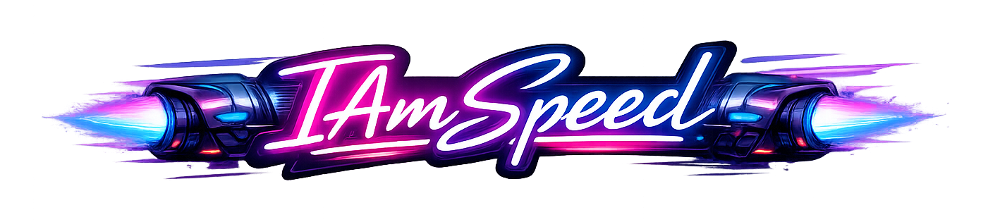

# ⚡ IAmSpeedEngine ⚡

**A physics-first gameplay framework for Unreal Engine 5**  
Built for fast-paced arcade experiences: sky cars, balls, and high-speed collisions.

---
**IAmSpeedEngine** is a custom gameplay & physics framework built on top of **Unreal Engine 5**, designed for fast-paced arcade games driven by physics. It currently powers **Sky League**—a game about sky cars, soccer matches, races, and other competitive/co‑op modes. citeturn0search0turn1view0

Rather than trying to replace Unreal Engine, IAmSpeedEngine acts as a focused *engine layer* for developers who want more control over:

- high-speed physical interactions and collision robustness,
- deterministic-friendly gameplay logic,
- reusable physics-oriented gameplay primitives,
- networking patterns adapted to competitive physics gameplay.

> **Goal:** a solid foundation for arcade experiences where **precision**, **responsiveness**, and **performance** matter.

---

## Why IAmSpeedEngine?

Arcade physics games often need more than generic movement and default collision settings. They typically require:

- **Precise collision handling at high speed** (missed collisions are a fun killer),
- **Stable simulation** for dynamic bodies,
- **Reusable gameplay primitives** (cars, balls, sensors),
- **Vehicle-oriented architecture** for responsive driving,
- **Netcode foundations** that match fast, competitive physics gameplay.

---

## Main features

### Continuous Collision Detection (CCD) first
The framework is designed around a CCD‑oriented workflow to reduce missed collisions and improve robustness for fast-moving gameplay objects.

### Physics-oriented gameplay primitives
Reusable core sub‑bodies intended as building blocks for vehicles, balls, sensors, and other dynamic elements:

- Boxes  
- Spheres  
- Wheels  

### World-level collision orchestration
A dedicated **World Subsystem** orchestrates collision queries and the interaction flow between registered physical components.

### Vehicle-ready architecture
Basic components for arcade vehicles, including wheel-based setups and higher-level movement structures tailored to responsive driving gameplay.

### Built-in netcode foundations
Networking support intended for multiplayer physics gameplay, with systems designed to better fit fast arcade interactions than a purely generic setup.

---

## Repository layout

This repository exposes the Unreal plugin structure:

- `IAmSpeed.uplugin`
- `Source/IAmSpeed/`
- `LICENSE` (MIT)

citeturn1view0

---

## Getting started

### Prerequisites
- Unreal Engine 5 (project configured for C++ development)

### Install (as a project plugin)
1. Clone or download this repository.
2. Copy the folder into your UE project at:  
   `YourProject/Plugins/IAmSpeedEngine/`
3. Regenerate project files (if needed), then build your project.

> If you are using a dedicated server or multiple target platforms, ensure the plugin is enabled for all relevant targets in your project settings.

---

## Designed for Sky League

IAmSpeedEngine is the technology layer behind **Sky League**, an upcoming game listed on Steam with a planned release window of **Q4 2027**. citeturn0search0turn0search2

Sky League is a natural showcase for what IAmSpeedEngine is built for:

- vehicle-based competitive gameplay,
- precise ball and car interactions,
- high-speed collisions,
- responsive online physics gameplay.

---

## Philosophy

IAmSpeedEngine follows a simple philosophy:

- stay inside **Unreal Engine 5**, instead of replacing it,
- minimize unnecessary abstraction,
- focus on arcade gameplay needs first,
- favor precision and responsiveness,
- provide a reusable framework for physics-heavy arcade games.

---

## Status

This is an early public repository exposing the plugin structure and core module(s). Expect iteration and change as the project evolves.

---

## Contributing

Contributions, feedback, and experimentation around arcade physics, vehicle gameplay, CCD workflows, and multiplayer-oriented simulation are welcome.

- Open an issue with a clear reproduction (or minimal project) if possible
- Propose changes via pull request

---

## License

**MIT License**. See `LICENSE`.
